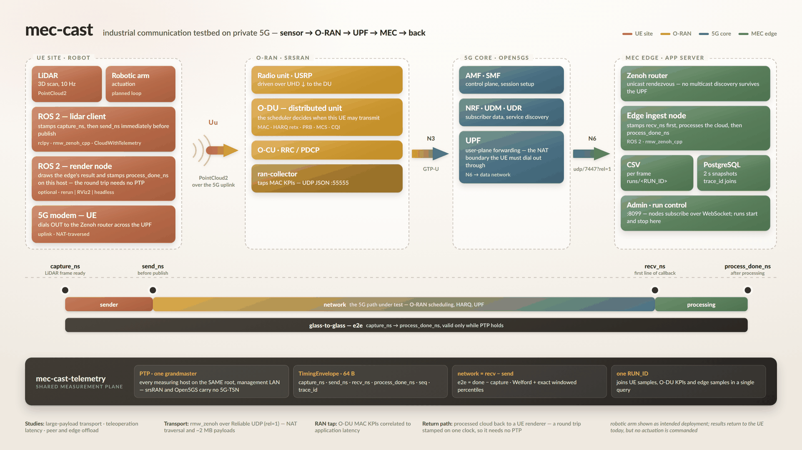

# mec-cast

[](docs/diagrams/system-hero.png)

<sub>Click for the full-resolution version. Source:
[`system-hero.html`](docs/diagrams/system-hero.html)</sub>

An **experimentation testbed for industrial communication over private 5G**,
built on srsRAN and Open5GS. It exists to run real workloads across a real
radio network and study how they behave — so that design choices can be
tested rather than argued.

What it is used to investigate:

- **Large data transmission in industrial systems** — how bulk sensor
  payloads behave on a constrained uplink, and what makes them behave better
- **Minimal latency for teleoperation** — where the delay actually accrues,
  and which part of the stack is worth changing
- **Fast communication between nearby peers and edge processing** — what the
  edge can offload from a machine that cannot carry the compute itself

To answer those questions the testbed provides reproducible workloads,
RAN-level observability, transport comparison under identical conditions,
controlled impairment, and PTP-disciplined timing across hosts. **The
timestamping is one instrument, not the purpose** — it is what makes the
other answers trustworthy.

Two workload profiles share one Rust telemetry spine:

- **Profile A — robotics:** ROS2 LiDAR point clouds over `rmw_zenoh`, from a
  UE (robot compute + 5G modem) across an srsRAN/Open5GS lab network to a
  MEC edge server, plus a tap on the srsRAN O-DU MAC scheduler.
- **Profile B — media:** WebRTC. Today the legacy libwebrtc client; the
  planned retarget onto [str0m](docs/architecture/str0m-profile.md) removes
  the need for a patched WebRTC fork.

More detail: [architecture overview and lab deployment](docs/diagrams/README.md)
(rendered inline), or the two detailed dataflow diagrams —
[measurement lifecycle](docs/diagrams/dataflow-measurement-lifecycle.png) and
[runtime topology](docs/diagrams/dataflow-runtime-topology.png).

## Quick start

```bash
bash scripts/bootstrap-dev.sh   # rust, venv, wheel, submodules
make test                       # fast tests, no docker
make test-all                   # adds containers + full netem e2e
```

```bash
bash scripts/run-experiment.sh -d 60 -n 30000 -t "baseline"
```

Run `make help` for all targets.

## Components

| # | Component | Location |
|---|---|---|
| 1 | **Client components** (UE side) | [`clients/`](clients/README.md) |
| 1.i | ROS2 lidar client node | [`ros2/src/mec_cast_lidar_client/`](ros2/README.md) |
| 1.ii | WebRTC native client | [`clients/webrtc_native/`](clients/webrtc_native/README.md) |
| 2 | **MEC server components** | [`edge/`](edge/README.md) |
| 2.i | Zenoh ingest layer for ROS2 | [`ros2/src/mec_cast_edge/`](ros2/README.md) |
| 2.ii | str0m SFU (planned) | [design](docs/architecture/str0m-profile.md) |
| 3 | **Telemetry** — the shared spine | [`telemetry/`](telemetry/README.md) |
| 4 | **Logging service** (submodule) | [`services/logging/`](docs/operations/logging-submodule.md) |
| 5 | **Third-party, extended** | [`third_party/`](third_party/README.md) — [webrtc](docs/guides/building-libwebrtc.md), [str0m](docs/architecture/str0m-profile.md) |
| — | RAN metrics tap | [`ran/collector/`](ran/collector/README.md) |
| — | Deployment | [`deploy/`](deploy/README.md) |

The top level is organised by **deployment location**, so the tree mirrors
where code runs in the testbed. `ros2/` is one deliberate exception: it is a
single colcon workspace spanning client and edge, because splitting it
fights rosdep and ament for cosmetic gain.

## Build system

Five toolchains (cargo, maturin, npm, colcon, gn+ninja) — no single build
tool owns them. The [`Makefile`](Makefile) is a thin façade that only
*delegates*; build logic stays in each component's native tool, and CI calls
the same targets so local and CI cannot drift.

`make build-libwebrtc` is opt-in: ~20 GB and hours, never in CI.

## Documentation

[`docs/`](docs/README.md) holds cross-cutting material; component docs live
next to their code. Start with
[architecture/overview.md](docs/architecture/overview.md), and read the
[ADRs](docs/architecture/adr/README.md) before proposing to change a major
design decision — they record why Zenoh beat DDS, why the telemetry core is
Rust, why PTP stays off the 5G user plane, why percentiles are exact, and
why there is no RIC yet.

## Status

| Area | State |
|---|---|
| Telemetry crate (+ PyO3, C ABI) | Working, tested |
| ROS2 + Zenoh profile | Working; netem e2e green |
| WebRTC profile → telemetry | Wired over the C ABI; needs a camera to confirm |
| RAN metrics tap | Working against a captured fixture |
| Logging service submodule | Wired at `services/logging` |
| str0m fork vendored | `third_party/str0m` (v0.21.0) |
| str0m SFU implementation | Not started — [design](docs/architecture/str0m-profile.md) |
| Draco compression | Not started |

## Development note

AI coding tools were used in generating and restructuring parts of this
project — including source, tests, deployment configuration, and
documentation. All of it is reviewed and validated by the maintainers
before use, and the test suites described above are the evidence: the
telemetry statistics, the ROS2 pipeline, and the end-to-end latency path
are covered by automated tests rather than accepted on trust.

Measurement results should be judged on the reproducibility artifacts —
`runs/<run_id>/run.json`, the per-frame CSV, and PTP sync status — not on
the provenance of the code that produced them.

## License

MIT — see [LICENSE](LICENSE).
