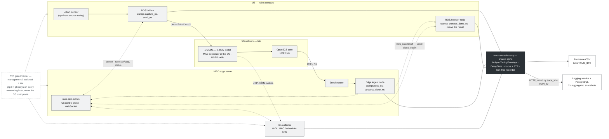
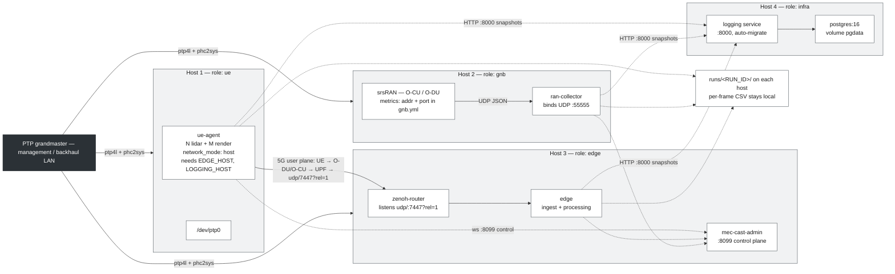
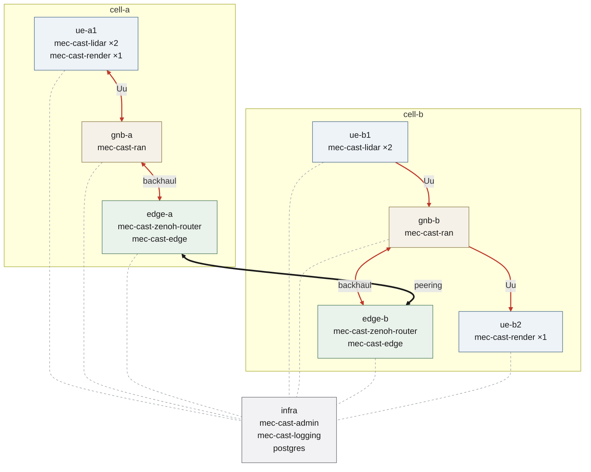

# Diagrams

Sources and rendered artifacts for the platform's diagrams. Everything here is
generated from a text source that lives beside it — edit the source, re-render,
never touch the output.

## How GitHub actually renders these

Worth stating plainly, because it drives every decision below:

- GitHub renders Mermaid **inside a ` ```mermaid ` fence in a markdown file**.
- GitHub does **not** render a standalone `.mmd` file — open one and you get
  plain text.
- A Mermaid `.svg` uses `<foreignObject>` for its labels, and GitHub's
  sanitiser strips it, so the diagram often appears blank or partial.

So: overview diagrams are **embedded as fences** (below) and ship no image at
all; the detailed ones ship a **PNG**, which is the format GitHub can display.
SVG is generated on demand for print and is not committed.

## What is kept, and why

| File | Format | Why it exists |
|---|---|---|
| `architecture-overview.mmd` | source only | embedded below — GitHub renders it |
| `lab-deployment.mmd` | source only | embedded below — GitHub renders it |
| `mec-cast-nodes.mmd` | source only | embedded below — the extended-model target topology |
| `dataflow-measurement-lifecycle.mmd` | source | too large to embed readably |
| `dataflow-runtime-topology.mmd` | source | too large to embed readably |
| `dataflow-*.png` | raster | the copy GitHub can actually display |
| `dataflow-*.svg` | vector | **not committed** — `render.sh --svg` when a paper needs it |
| `system-hero.html` | source | the one-picture overview |
| `system-hero.png` | 2880×1620 | slides, print |
| `system-hero-web.png` | 1600×900, 346 KB | embedded in the root README |

Two hero files on purpose: the root README is the most-loaded page in the
repo and should not pull a multi-megabyte image. Never swap the full-size one
into the README.

**Committing binaries:** regenerate as often as you like, but commit a PNG or
SVG only when the diagram meaningfully changed. Git stores each binary
revision whole — during one afternoon of iteration the hero was regenerated
seven times, which would have added ~30 MB of history for a single image.

## Rendering

```bash
bash docs/diagrams/render.sh
```

```bash
bash .claude/skills/doc-sync/scripts/render_hero.sh
```

Needs `@mermaid-js/mermaid-cli` (which brings its own Chromium). The two
overview diagrams need no toolchain at all — GitHub renders them from the
fences below.

## Editing

The palette and fonts are set once per file, in the `%%{init: …}%%` block and
the `classDef` lines. Change a hex value there, never per-node. Grayscale
only; dark fill `#2B3136` means *timestamp* in the lifecycle diagram and
*clock authority* elsewhere.

Never leave a bare `%%` line — Mermaid can read it as a directive and swallow
the lines that follow.

---

## Architecture overview

Source: [`architecture-overview.mmd`](architecture-overview.mmd) — keep the two
copies identical when editing.



## Lab deployment

Source: [`lab-deployment.mmd`](lab-deployment.mmd). Deploy order:
`infra → edge → gnb → ue`.



## Node topology (extended model)

Source: [`mec-cast-nodes.mmd`](mec-cast-nodes.mmd) — keep the two copies
identical when editing.

The target of the multi-cell migration: two cells of `UE → gNB → Edge`, the
edges peered, one shared infra. Three planes — **data** (red), **peering**
(black, the Zenoh router↔router session; transport plumbing, not application
control), **control** (dashed, the admin WebSocket). `cell-a` keeps lidar and
render on one UE while `cell-b` splits them across two: that contrast is
deliberate, because ADR-0009's round-trip `e2e_ns` is PTP-free only while both
stamps come off one host's clock — `ue-b2` is the case the
`WF_RENDER_CROSS_HOST` finding exists to catch.



Note: today's deployment differs from this picture in one load-bearing way —
the admin service currently runs in the **edge** role, not on infra. Moving it
is required by the multi-cell milestone (two edges would otherwise mean two
authorities) and is tracked there, not a drawing error here.

## Detailed dataflow

Too large to embed readably; rendered instead.

**Measurement lifecycle** — one frame's journey through every timestamp,
thread and queue.
[PNG](dataflow-measurement-lifecycle.png) ·
[source](dataflow-measurement-lifecycle.mmd)

**Runtime topology** — every process, port, protocol, env var and volume.
[PNG](dataflow-runtime-topology.png) ·
[source](dataflow-runtime-topology.mmd)

For print or a paper, `bash docs/diagrams/render.sh --svg` produces vector
copies alongside (gitignored).

## The hero image

`system-hero.html` is hand-written HTML/CSS rather than Mermaid: it needs
gradients, soft shadows and real typographic control, and it is meant for
people who will not read anything else. Four sites over a measurement axis,
using the vocabulary an O-RAN or ROS2 reader already knows.

The full design contract lives in the
[`doc-sync` skill](../../.claude/skills/doc-sync/SKILL.md).

## Known limitation: auto-layout

The Mermaid diagrams are laid out automatically rather than hand-positioned.
That keeps the source easy to edit, but the router occasionally draws an edge
across a box it is not logically connected to (visible on
`dataflow-runtime-topology`). The connection itself is always correct; only
the visual path is imperfect. If a diagram ever needs exact positioning,
hand-authored SVG is the alternative.
